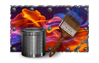
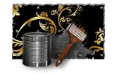

---

# Utanu's Tarkov Texture Pack

## Welcome to my Addon

*   - *If you are here, you probably know for what mod this is for. If not... well... ok ok... check this mod.*
        - **Weapon Camo and Stickers** - Created by **7bpencil**
            - https://forge.sp-tarkov.com/mod/2658/weapon-camo-and-stickers

---

## Textures Included

   - Forest
   - Desert
   - Snow
   - Urban
   - Military
   - Material
   - Natural
   - Animal
   - Special *(Future Update Preview)*

### Colors

Color Names

   - Mono Red
   - Mono Coral
   - Mono Orange
   - Mono Gold
   - Mono Yellow
   - Mono Apple
   - Mono Aquamarine
   - Mono Azure
   - Mono Blue
   - Mono Violet
   - Mono Fuschia
   - Mono Dark Red
   - Mono Dark Green
   - Texture White 
   - Texture Black
   - Texture Metallic

### Forest Textures

Texture Names

   - Classic Woodland
   - German Flecktarn
   - U.S. M81 Woodland
   - Woodland MARPAT
   - PenCott GreenZone
   - MultiCam Tropic
   - Dense Vegetation
   - Dark Wet Forest
   - Dry Foliage
   - Moss & Bark
   - Tropical Jungle
   - European Woodland
   - Pine Forest
   - Amazon Rainforest
   - Branches & Leaves

### Desert Textures

Texture Names

   - Desert Tri-Color
   - Classic DCU
   - MultiCam Arid
   - Rocky Desert
   - Light Sand
   - Dark Sand
   - Windblown Dunes
   - Stony Desert
   - Yellow Sahara
   - Cracked Dry Earth
   - Brown Dust
   - Red Canyon
   - Stone & Sand
   - Urban Arid
   - Minimal Tactical Beige
   - Orange Sand

### Snow Textures

Texture Names

   - Pure White Snow Camo
   - White Splinter
   - Snow & Ice
   - Dirty Snow
   - Gray Tundra
   - Boreal Winter
   - Blue Arctic Camo
   - Cracked White
   - Crystal Frost
   - Snowstorm
   - Polar Ice
   - Snow & Dry Branches
   - Matte Military White
   - Winter Digital
   - Arctic Gray Blotches

### Urban Textures

Texture Names

   - Urban Gray
   - Urban Digital
   - Cracked Asphalt
   - Industrial Concrete
   - Urban Ruins
   - Tactical Gray & Black
   - Rainy City
   - Brick & Concrete
   - Urban Oxidized Metal
   - Blue-Gray Urban
   - Peeling Wall
   - Subtle Urban Graffiti
   - Wet Asphalt
   - Industrial Zone
   - Night Urban

### Military Textures

Texture Names

   - MultiCam Black
   - MultiCam Red
   - MultiCam Blue
   - MultiCam Snow
   - Black Hex Camo
   - Green Hex Camo
   - Sand Hex Camo
   - Red & Black Digital
   - Navy Digital
   - White & Gray Digital
   - Modern Splinter Camo
   - Neon Splinter
   - Classic Tiger Stripe
   - Desert Tiger Stripe
   - Urban Tiger Stripe
   - Ice Tiger Stripe
   - Rhodesian Brushstroke
   - Retro ERDL
   - Lizard Camo
   - British DPM
   - Stylized CADPAT
   - Kryptek-Inspired
   - Matte Low-Vis Pattern
   - Reverse Camo
   - Asymmetric Camo

### Material Textures

Texture Names

   - Carbon Fiber
   - Brushed Steel
   - Burnt Metal
   - Blued Titanium
   - Anodized Aluminum
   - Oxidized Steel
   - Rusty Iron
   - Aged Copper
   - Tactical Bronze
   - Welded Plate
   - Textured Kevlar
   - Tactical Rubber
   - Matte Polymer
   - Worn Cerakote
   - Chipped Paint
   - Black Light Battle-Worn
   - Soot and Residue
   - Dry Mud
   - Wet Mud
   - Black Resin
   - Hammered Surface

### Natural Textures

Texture Names

   - Tree Bark
   - Burnt Trunk
   - Gray Stone
   - Volcanic Rock
   - Granite
   - Dark Marble
   - Fractured White Marble
   - Obsidian
   - Wet Moss
   - Lichen
   - Red Earth
   - Autumn Leaves
   - Dry Leaves
   - Swamp Mud
   - Murky Water
   - Dark Algae
   - Snow-Covered Rock
   - Frozen Ground
   - Exposed Roots
   - Subtle Floral Camo

### Animal Textures

Texture Names

   - Green Snake Skin
   - Black Snake Skin
   - Desert Viper Skin
   - Crocodile Skin
   - Fantasy Reptile Scales
   - Tactical Zebra
   - Dark Orange Tiger
   - White Tiger
   - Shadow Leopard
   - Fire Leopard
   - Dark Jaguar
   - Sand Cheetah
   - Cartoon Sand Cheetah
   - Gray Wolf
   - Matte Black Raven
   - Silver Raven
   - Brown Eagle
   - Cartoon Brown Eagle
   - Insect Carapace
   - Venomous Spider
   - Iridescent Beetle Shell
   - Stylized Dragon Scales
   - Dark Dragon Breath
   - Emerald Wyvern
   - Minotaur Fury
   - Cartoon Sharks
   - Only Sharks
   - Shark Scales
   - Polar Bear Fur
   - Metal Scales
   - Albino Python Skin 
   - Phantom Lynx 
   - Iron Scorpion 
   - Savage Hornet 

---

### Special Textures

Texture Names

*Some people will recognize this paints*

   - Afterburner

   - Hohloma

   - Purple Urban
   - Neon Strike

## Future Plans

Q: This Addon will be updated?
 
A: Yes, I have more than 600 Textures planned including from other games. Will be possible to recreate other games textures? Maybe...
 
 
Q: Why do you have all this planned already? The mod just released...
 
A: I love skins and I have database of many things and games, and one thing I always wanted is Skins on Tarkov, so that's it.
 
 
Q: You'll try to include other games textures?
 
A: Yes my man who like skins and shooting games, **CSGO** is included on my plans yes, but only a *look a like* texture, not the real one. Keep that in mind.

---

## Changelog

### Project Version 0.1.1

- Added a image for preview on ForgeSPT